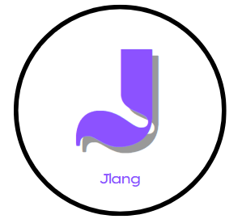

<p align="center">
  
</p>

<p align="center">
  <em>A procedural programming language inspired by C and Go.</em>
</p>

## Getting Started

### Prerequisites

You need LLVM installed on your system:

**Ubuntu/Debian:**
```bash
sudo apt install llvm-dev
```

**Fedora:**
```bash
sudo dnf install llvm-devel
```

**macOS:**
```bash
brew install llvm
```

### Build

```bash
mkdir -p build && cd build
cmake ..
make
```

Or from the project root:
```bash
cmake -B build && cmake --build build
```

### Run

```bash
./build/Jlang samples/sample.j
```

## Language Syntax

```
interface IPrintable {
    fn print();
}

struct Person : IPrintable {
    firstName: char*;
    age: i32;
}

fn print(self: Person*) {
    jout("First name: %s", self.firstName);
    jout("Age: %d", self.age);
}

fn main() -> i32 {
    var p: Person* = alloc<Person>();

    if (p == null) {
        jout("No can do");
    } else {
        jout("Incredible");
    }

    free(p);
    return 0;
}
```

## Syntax Design Decisions

Jlang's syntax is designed to be clean, explicit, and familiar to developers coming from C, Go, or Rust. Here are the key design decisions:

### Functions: `fn` keyword with trailing return type

```
fn add(a: i32, b: i32) -> i32 {
    return a + b;
}
```

The `fn` keyword is concise and widely recognized. Trailing return types (using `->`) improve readability, especially for longer parameter lists.

### Variables: `var` with colon-separated types

```
var name: char* = "Jlang";
var count: i32 = 42;
```

The colon syntax (`name: Type`) clearly separates identifiers from types and is consistent with modern languages like TypeScript, Kotlin, and Rust.

### Structs: colon for interface implementation

```
struct Person : IPrintable {
    firstName: char*;
    age: i32;
}
```

Using `:` for interface implementation follows C++/C# conventions and avoids overloading the `->` operator which is commonly associated with pointer dereferencing.

### Methods: explicit `self` parameter

```
fn print(self: Person*) {
    jout("Name: %s", self.firstName);
}
```

Explicit `self` makes the receiver clear and visible. There's no hidden magic - you can see exactly what the method operates on. This approach is similar to Python and Rust.

### Semicolons: required

All statements must end with a semicolon. This makes parsing unambiguous and aligns with C-family languages.

### Null: lowercase `null`

```
if (p == null) { ... }
```

Using lowercase `null` is consistent with most modern languages (Java, C#, JavaScript) and feels more natural than the C macro `NULL`.

### Memory: manual management

```
var p: Person* = alloc<Person>();
// ... use p ...
free(p);
```

Jlang uses explicit manual memory management with `alloc<T>()` and `free()`. This gives developers full control over memory and keeps the language simple without requiring a garbage collector or complex ownership system.

### Primitive types

| Type | Description |
|------|-------------|
| `i8`, `i16`, `i32`, `i64` | Signed integers |
| `u8`, `u16`, `u32`, `u64` | Unsigned integers |
| `f32`, `f64` | Floating point |
| `char` | Character |
| `bool` | Boolean |

Explicit bit-width types make memory layout predictable and clear.
