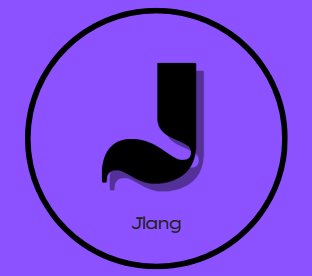

<p align="center">
  
</p>

<h1 align="center">Jlang</h1>

<p align="center">
  <em>A procedural programming language inspired by C and Go, built with LLVM, featuring JIT compilation.</em>
</p>


```Go
interface IPrintable
{
    void print();
}

struct Person -> IPrintable 
{
    var firstName char*; 
    var age int32; 
}

void print() -> Person p
{
    jout("First name: %s", p.firstName); 
    jout("Age: %d", p.age); 
}

int32 main()
{
    var Person* p = (struct Person*) jalloc(sizeof(struct Person));

    if (p == NULL) 
    {
        jout("No can do"); 
    }
    else 
    {
        jout("Incredible");
    }

    jfree(p);
}
